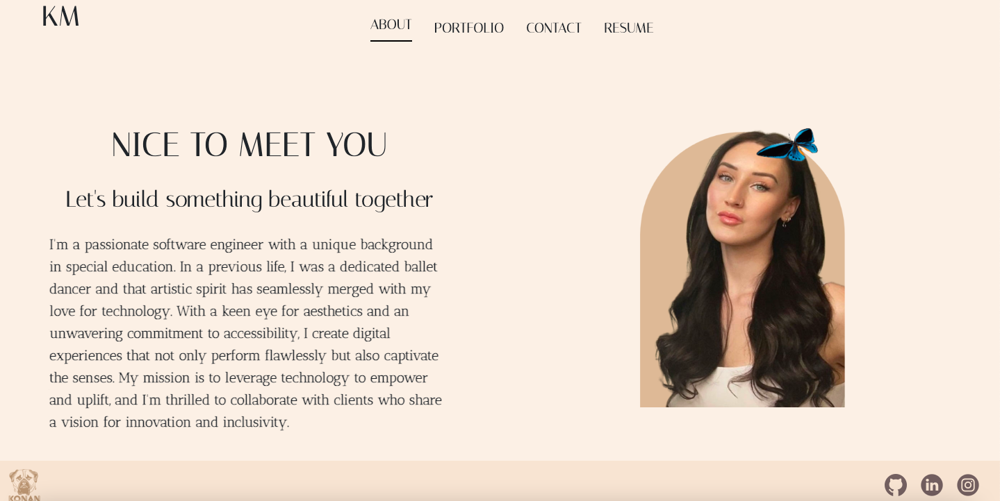
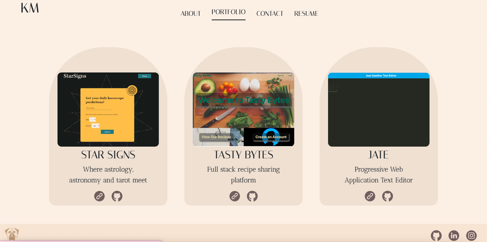
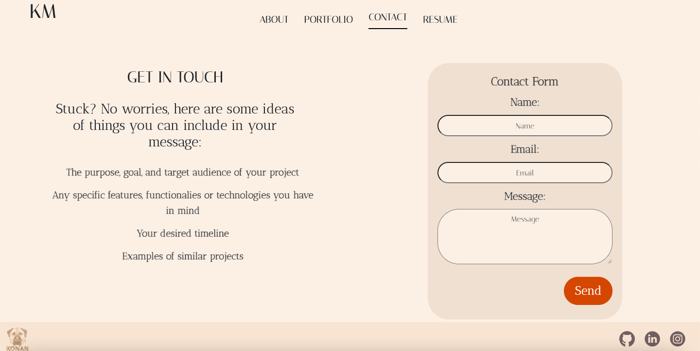
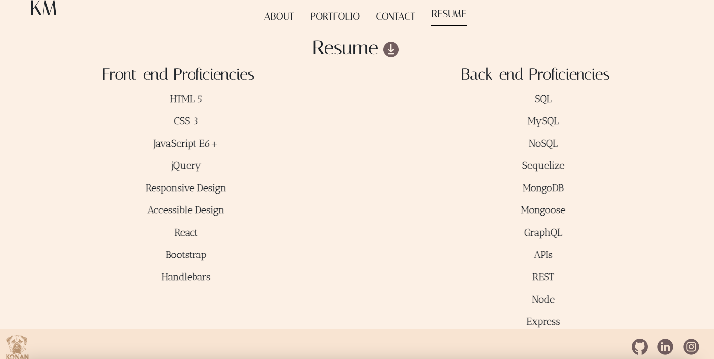

# Portfolio

## Description:
This repository houses the code for my personal portfolio website.

## Table of Contents

- [Description](#description)
- [Usage](#usage)
- [Demonstration](#demonstration)
- [Links](#links)
- [Technologies](#technologies)
- [Accessibility](#accessibility) 
- [License](#license)

## Usage:
If you would like to use my portfolio structure and/or styles yourself, please follow these steps:

1. Clone the repository.

2. `npm install`.

3. `npm start`.

4. The webpage will run at http://localhost:3000.

## Demonstration:

1. **Home/About Page** 

2. **Portfolio Page**

3. **Contact Page**

4. **Resume Page**

## Links: 
- Repository: [Link to the repository]
- Deployed: [Link to the deployed website]

## Technologies

- React
- JavaScript
- Framer Motion
- Flat icon
- Google Fonts

## Accessibility
Accessibility is very close to my heart. Here are some things I have included:

- High contrast background and font/icon colors 
- Large size fonts with increased space between lines
- Readable font styles 
- Moving elements are touchscreen-friendly
- Descriptive alt tags
- Semantic HTML
- ARIA (Accessible Rich Internet Applications) Roles and Attributes info for links
- Form Accessibility
- Responsive Design
- Consistent Layout

## License:
My Portfolio is licensed under the [MIT License](https://opensource.org/license/mit/).

_The MIT License is a permissive open-source license that allows you to use, modify, and distribute the project for both commercial and non-commercial purposes. It provides you with the freedom to customize the application to suit your needs._
